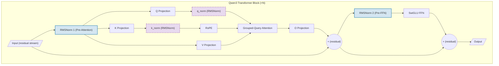
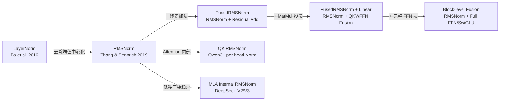

# RMSNorm 模型研究

## 模型场景

RMSNorm 是现代大语言模型（LLM）中最核心的归一化算子之一。它取代了 Transformer 原始设计中广泛使用的 LayerNorm，成为 LLaMA 系列、Mistral、DeepSeek、Qwen 等几乎所有主流开源 LLM 的默认归一化方案。在每个 Decoder-only Transformer Block 中，RMSNorm 出现两次（Pre-Attention 和 Pre-FFN），是每一层前向传播路径上调用频率最高的算子之一。其简化的计算流程（去除均值中心化步骤）不仅加速了训练和推理，还催生了一系列算子融合优化，如 RMSNorm + Linear/QKV 投影融合，可显著减少 HBM 读写和中间 tensor 显存占用。

---

## 模型分析

### LLaMA 系列（LLaMA / LLaMA-2 / LLaMA-3）

#### 模型结构

LLaMA 基于 Decoder-only Transformer，采用 **Pre-Norm + RMSNorm** 结构。每个 Transformer Block 包含两个 RMSNorm 实例：

```mermaid
graph TD
    subgraph "LLaMA Transformer Block (×N)"
        IN[/"Input (residual stream)"/]
        A1["RMSNorm 1 (Pre-Attention)"]
        QKV["QKV Projection (MatMul)"]
        RoPE["RoPE (Rotary Position Embedding)"]
        ATTN["Grouped-Query Attention"]
        OUT1["Output Projection (MatMul)"]
        ADD1(("+ (residual)"))

        A2["RMSNorm 2 (Pre-FFN)"]
        FFN_UP["Gate & Up Projection (MatMul)"]
        SWIGLU["SwiGLU Activation"]
        FFN_DOWN["Down Projection (MatMul)"]
        ADD2(("+ (residual)"))

        OUT[/"Output (residual stream)"/]
    end

    IN --> A1 --> QKV --> RoPE --> ATTN --> OUT1 --> ADD1
    IN --> ADD1
    ADD1 --> A2 --> FFN_UP --> SWIGLU --> FFN_DOWN --> ADD2
    ADD1 --> ADD2
    ADD2 --> OUT

    style A1 fill:#d4e6f1,stroke:#2980b9,stroke-width:2px
    style A2 fill:#d4e6f1,stroke:#2980b9,stroke-width:2px
```

#### 算子输入输出

| 参数 | 类型 | 形状 | 描述 |
|:-----|:-----|:-----|:-----|
| input | Tensor | [batch, seq_len, dim] | 残差流输入，归一化沿最后一维 dim |
| weight (gamma) | Parameter | [dim] | 可学习缩放参数，初始化为全 1 |
| output | Tensor | [batch, seq_len, dim] | 归一化后输出，形状同输入 |

#### 计算逻辑

RMSNorm 沿最后一维（`dim`，即 hidden_size）计算均方根（RMS），然后将输入除以 RMS 再乘以可学习权重 gamma。公式为：

$$\hat{x} = \frac{x}{\sqrt{\frac{1}{d}\sum_{i=1}^{d}x_i^2 + \epsilon}} \odot \gamma$$

LLaMA 官方实现中，计算在 fp32 精度下进行（`.float()`），使用 `torch.rsqrt` 实现倒数平方根，epsilon 参数来自 `ModelArgs.norm_eps`。LLaMA/LLaMA-2/LLaMA-3 在结构上保持 RMSNorm 位置一致（Pre-Attention + Pre-FFN），主要变化在于 hidden_size 维度随模型规模扩展：7B/8B 使用 dim=4096，70B 使用 dim=8192。

#### 参考信息

| 描述 | 链接 |
|:-----|:-----|
| LLaMA Paper | https://arxiv.org/abs/2302.13971 |
| LLaMA-2 Paper | https://arxiv.org/abs/2307.09288 |
| LLaMA-3 模型主页 | https://ai.meta.com/research/publications/the-llama-3-herd-of-models/ |
| 官方代码 (LLaMA) | https://github.com/facebookresearch/llama |
| 官方代码 (LLaMA-2/3) | https://github.com/meta-llama/llama |
| HuggingFace | https://huggingface.co/meta-llama |

---

### Mistral（Mistral 7B / Mixtral 8x7B）

#### 模型结构

Mistral 7B 同样基于 Decoder-only Transformer，继承 LLaMA 架构体系，使用 Pre-Norm + RMSNorm。独特之处是引入了 **Sliding Window Attention (SWA)** 和 **Grouped-Query Attention (GQA)**：

```mermaid
graph TD
    subgraph "Mistral Transformer Block (×N)"
        IN[/"Input (residual stream)"/]
        A1["RMSNorm 1 (Pre-Attention)"]
        QKV["QKV Projection (MatMul)"]
        RoPE["RoPE"]
        SWA["Sliding Window Attention (SWA)"]
        OUT1["Output Projection (MatMul)"]
        ADD1(("+ (residual)"))

        A2["RMSNorm 2 (Pre-FFN)"]
        FFN_UP["Gate & Up Projection"]
        SWIGLU["SwiGLU"]
        FFN_DOWN["Down Projection"]
        ADD2(("+ (residual)"))

        OUT[/"Output"/]
    end

    IN --> A1 --> QKV --> RoPE --> SWA --> OUT1 --> ADD1
    IN --> ADD1
    ADD1 --> A2 --> FFN_UP --> SWIGLU --> FFN_DOWN --> ADD2
    ADD1 --> ADD2
    ADD2 --> OUT

    style A1 fill:#d4e6f1,stroke:#2980b9,stroke-width:2px
    style A2 fill:#d4e6f1,stroke:#2980b9,stroke-width:2px
    style SWA fill:#fcf3cf,stroke:#f1c40f,stroke-width:2px
```

#### 算子输入输出

与 LLaMA 相同，Mistral 的 RMSNorm 输入为 [batch, seq_len, hidden_size]。Mistral 7B 的 hidden_size=4096，32 层，每层两个 RMSNorm，共 64 个 RMSNorm 实例。

#### 计算逻辑

RMSNorm 实现与 LLaMA 相同。值得注意的是，Mixtral 8x7B（MoE 版本）取消了 Sliding Window Attention（SWA 窗口设为 null），但 RMSNorm 位置和使用方式保持不变。在 Mixtral 中，FFN 被替换为 MoE 层（8 个专家中选 2 个），但 Pre-FFN 的 RMSNorm 依然存在。

#### 参考信息

| 描述 | 链接 |
|:-----|:-----|
| Mistral 7B Paper | https://arxiv.org/abs/2310.06825 |
| Mixtral Paper | https://arxiv.org/abs/2401.04088 |
| HuggingFace | https://huggingface.co/mistralai |

---

### DeepSeek-V2/V3

#### 模型结构

DeepSeek-V2/V3 的架构最为复杂，RSNorm 不仅出现在常规的 Pre-Attention 和 Pre-FFN 位置，还在 **Multi-Head Latent Attention (MLA)** 内部出现，用于稳定低秩压缩后的特征分布：

```mermaid
graph TD
    subgraph "DeepSeek-V2/V3 Transformer Block (×N)"
        IN[/"Input (residual stream)"/]
        A1["RMSNorm 1 (Pre-Attention)"]

        subgraph MLA["Multi-Head Latent Attention (MLA)"]
            Q_DOWN["Q Down-Projection (h→c_Q)"]
            Q_RMS["q_a_layernorm (RMSNorm)"]
            Q_UP["Q Up-Projection (c_Q→q)"]
            KV_DOWN["KV Down-Projection (h→c_KV)"]
            KV_RMS["kv_a_layernorm (RMSNorm)"]
            KV_UP["K/V Up-Projection (c_KV→k,v)"]
            RoPE_D["Decoupled RoPE"]
            ATTN["Attention Score Computation"]
            ATT_V["Attention × V"]
            OUT1["Output Projection"]
        end

        ADD1(("+ (residual)"))

        A2["RMSNorm 2 (Pre-FFN)"]
        MOE["MoE Layer (160 experts + 2 shared)"]
        ADD2(("+ (residual)"))

        OUT[/"Output"/]
    end

    IN --> A1 --> Q_DOWN --> Q_RMS --> Q_UP --> ATTN
    A1 --> KV_DOWN --> KV_RMS --> KV_UP --> ATTN
    KV_UP --> RoPE_D --> ATTN
    ATTN --> ATT_V --> OUT1 --> ADD1
    IN --> ADD1
    ADD1 --> A2 --> MOE --> ADD2
    ADD1 --> ADD2
    ADD2 --> OUT

    style A1 fill:#d4e6f1,stroke:#2980b9,stroke-width:2px
    style A2 fill:#d4e6f1,stroke:#2980b9,stroke-width:2px
    style Q_RMS fill:#fdedec,stroke:#e74c3c,stroke-width:2px,stroke-dasharray: 5 5
    style KV_RMS fill:#fdedec,stroke:#e74c3c,stroke-width:2px,stroke-dasharray: 5 5
```

#### 算子输入输出

| 位置 | 输入形状 | 描述 |
|:-----|:--------|:-----|
| input_layernorm | [batch, seq_len, 7168] | Pre-Attention 归一化，dim=7168 (V3) |
| q_a_layernorm | [batch, seq_len, 1536] | Q 压缩后的特征归一化，dim=1536 |
| kv_a_layernorm | [batch, seq_len, 512] | KV 压缩后的特征归一化，dim=512 |
| post_attention_layernorm | [batch, seq_len, 7168] | Pre-FFN/MoE 归一化 |
| final norm | [batch, seq_len, 7168] | 输出前最终归一化 |

#### 计算逻辑

DeepSeek-V2 的设计动机明确指出："低秩压缩和细粒度专家划分会影响层输出的尺度"，因此在压缩瓶颈处（压缩后的 Q 和 KV 潜在向量）增加了额外 RMSNorm 层来维持训练稳定性。所有 RMSNorm 使用 eps=1e-6，weight 参数存储在 fp32。MLA 核心思想是通过 KV 低秩压缩（dim 降至 512）大幅减少 KV Cache 内存（相比全量 MHA 减少 93.3%），而 RMSNorm 是保持这一压缩结构训练稳定的关键组件。

#### 参考信息

| 描述 | 链接 |
|:-----|:-----|
| DeepSeek-V2 Paper | https://arxiv.org/abs/2405.04434 |
| DeepSeek-V3 Paper | https://arxiv.org/abs/2412.19437 |
| 官方代码 | https://github.com/deepseek-ai/DeepSeek-V3 |
| HuggingFace (V3 Config) | https://huggingface.co/deepseek-ai/DeepSeek-V3/blob/main/inference/configs/config_671B.json |

---

### Qwen（Qwen2 / Qwen2.5 / Qwen3）

#### 模型结构

Qwen 系列架构紧密跟随 LLaMA 体系。Qwen3 在标准 Pre-Norm RMSNorm 之外，还引入了 **QK Normalization**——在 Attention 内部对 Q 和 K 投影分别施加额外的 RMSNorm：

#### 算子输入输出

Qwen3 额外增加了 Q/K RMSNorm（由 `qk_norm=True` 控制）：

| 位置 | 输入形状 | 描述 |
|:-----|:--------|:-----|
| Attention Pre-Norm | [batch, seq_len, hidden_size] | 标准 Pre-Attention 归一化 |
| Q Norm | [batch, num_heads, seq_len, head_dim] | 按 head 归一化 Q 投影结果 |
| K Norm | [batch, num_kv_heads, seq_len, head_dim] | 按 head 归一化 K 投影结果 |
| FFN Pre-Norm | [batch, seq_len, hidden_size] | 标准 Pre-FFN 归一化 |

#### 计算逻辑

Qwen 的 RMSNorm 实现等同于 T5LayerNorm 风格——不使用 bias（没有 beta 参数），计算在 fp32 下进行，默认 eps=1e-6。QK Normalization 是 Qwen3 的创新点，通过在 Attention 内部增加归一化来改善大 hidden_size 下的训练数值稳定性，降低对权重初始化的敏感度。

#### 参考信息

| 描述 | 链接 |
|:-----|:-----|
| Qwen2 Technical Report | https://arxiv.org/abs/2407.10671 |
| Qwen2.5 Technical Report | https://arxiv.org/abs/2412.15115 |
| Qwen3 技术报告 | https://arxiv.org/abs/2505.09388 |
| HuggingFace | https://huggingface.co/Qwen |

---

## 综合对比表

| 模型 | RMSNorm 位置 | 输入维度 (max) | epsilon | 融合优化 |
|:-----|:------------|:--------------|:--------|:--------|
| LLaMA / LLaMA-2 | Pre-Attn, Pre-FFN | 4096 / 8192 | 1e-5 | RMSNorm+QKV Fusion |
| LLaMA-3 | Pre-Attn (GQA), Pre-FFN | 4096 (8B), 8192 (70B) | 1e-5 | RMSNorm+QKV Fusion, FlashNorm |
| Mistral 7B | Pre-Attn (GQA + SWA), Pre-FFN | 4096 | 1e-5 | RMSNorm+QKV Fusion |
| Mixtral 8x7B | Pre-Attn (GQA), Pre-MoE | 4096 | 1e-5 | RMSNorm+QKV Fusion |
| DeepSeek-V2 (236B) | Pre-Attn, MLA 内部 (q/kv_a_layernorm), Pre-MoE, final norm | 5120 (MLA 内部: 1536/512) | 1e-6 | RMSNorm+QKV, RMSNorm+MoE Router |
| DeepSeek-V3 (671B) | 同 V2（61层） | 7168 (MLA 内部: 1536/512) | 1e-6 | Blockbuster 级别 RMSNorm+FFN Fusion |
| Qwen2 | Pre-Attn (GQA), Pre-FFN | 4096 (7B), 8192 (72B) | 1e-6 | RMSNorm+QKV Fusion |
| Qwen3 | Pre-Attn (GQA), Q/K Norm, Pre-FFN/MoE | 4096 ~ 8192 | 1e-6 | RMSNorm+QKV + QK Norm 融合 |

**关键差异总结**：
1. epsilon 值分为两个阵营：LLaMA/Mistral 使用 **1e-5**，DeepSeek/Qwen 使用 **1e-6**。
2. 所有模型都使用 Pre-Norm 结构（归一化放在子层之前，而非之后）。
3. DeepSeek 的 MLA 额外引入了压缩空间的 RMSNorm（维度更小，512 或 1536），这是独特的设计点。
4. Qwen3 的 QK Normalization 是另一个创新——在 Attention 内部引入 per-head RMSNorm。

---

## 调用模式建议

基于以上模型分析，对 NPU 上 RMSNorm 算子的实现提出以下建议：

1. **支持双 epsilon 标准**：算子接口应允许配置 epsilon，覆盖 `1e-5`（LLaMA 生态）和 `1e-6`（DeepSeek/Qwen 生态）两个常用值。
2. **融合是第一优先级**：RMSNorm 最频繁的调用场景是紧接着 Linear/QKV 投影。实现 RMSNorm + MatMul 融合算子（即融合 Pre-Attention 的 RMSNorm 和 QKV 投影）对端到端推理性能提升最为关键。参考 NVIDIA TensorRT-LLM（`FuseRMSNorm` 优化）和 Ascend C 的 RMSNorm+Linear 融合实践。
3. **小维度 RMSNorm**：DeepSeek MLA 内部存在 dim=512（KV 压缩空间）和 dim=1536（Q 压缩空间）的小维度 RMSNorm。默认的大维度优化策略（如 128 字节对齐）可能对小维度不友好，需要单独优化路径。
4. **支持 per-head QK Norm**：预留对 Qwen3/Qwen3-MoE 的 QK Normalization 支持——即在 head_dim 维度上的 RMSNorm，输入可能为 4D tensor [batch, heads, seq, head_dim]。
5. **buffer fusion 模式**：对于 NPU 场景，可参考 FlashInfer 的"缓存残差到共享内存"策略，在融合中避免将 RMSNorm 的输出写回 global memory，直接在 on-chip buffer 中传递给后续 MatMul。
6. **残差加法融合**：许多推理框架（vLLM, TensorRT-LLM）将残差加法并入 RMSNorm（即 `FusedAddRMSNorm`），一步完成 `out = RMSNorm(x + residual)`，减少一次显存读写。

---

## 语义演进关系

**演进逻辑**：
- **RMSNorm (2019)** 从 LayerNorm 中移除均值中心化步骤，只保留 RMS 重缩放，计算量减少但效果持平。
- **FusedRMSNorm (2022+)** 将残差加法（`x + residual`）与 RMSNorm 合并为单 kernel，减少一次 HBM 读写。
- **FusedRMSNorm + Linear (2023+)**（如 TensorRT-LLM 的 FuseRMSNorm 优化、Ascend C 的 RMSNorm+Linear 融合）在推理框架中成为标准优化，将 Pre-Attention 的 RMSNorm 与 QKV 投影矩阵乘法融合。
- **Block-level Fusion (2025)** 进一步提升融合粒度，将 RMSNorm 与整个 FFN/SwiGLU 块融合为单一 mega-kernel（Blockbuster, Microsoft Research）。
- **QK RMSNorm (2025)**（Qwen3）和 **MLA Internal RMSNorm (2024)**（DeepSeek-V2/V3）分别代表了在 Attention 内部引入额外 RMSNorm 的两个进化方向——前者用于 per-head 数值稳定，后者用于低秩压缩空间的特征正则化。

---

## 参考链接

以下为通过 Web 搜索验证的真实链接：

**根源论文与基础**：
- RMSNorm 原始论文: https://arxiv.org/abs/1910.07467 (Zhang & Sennrich, NeurIPS 2019)
- RMSNorm 官方代码: https://github.com/bzhangGo/rmsnorm

**LLaMA 系列**：
- LLaMA 论文: https://arxiv.org/abs/2302.13971 (Touvron et al., 2023)
- LLaMA-2 论文: https://arxiv.org/abs/2307.09288
- LLaMA-3 模型主页: https://ai.meta.com/research/publications/the-llama-3-herd-of-models/
- Meta LLaMA GitHub: https://github.com/facebookresearch/llama
- Meta LLaMA GitHub (后续版本): https://github.com/meta-llama/llama

**Mistral 系列**：
- Mistral 7B 论文: https://arxiv.org/abs/2310.06825 (Jiang et al., 2023)
- Mixtral 论文: https://arxiv.org/abs/2401.04088 (Jiang et al., 2024)
- HuggingFace: https://huggingface.co/mistralai

**DeepSeek 系列**：
- DeepSeek-V2 论文: https://arxiv.org/abs/2405.04434 (2024)
- DeepSeek-V3 论文: https://arxiv.org/abs/2412.19437 (2024)
- DeepSeek-V3 官方代码: https://github.com/deepseek-ai/DeepSeek-V3
- DeepSeek-V3 配置文件: https://huggingface.co/deepseek-ai/DeepSeek-V3/blob/main/inference/configs/config_671B.json

**Qwen 系列**：
- Qwen2 技术报告: https://arxiv.org/abs/2407.10671 (2024)
- Qwen2.5 技术报告: https://arxiv.org/abs/2412.15115
- Qwen3 技术报告: https://arxiv.org/abs/2505.09388 (2025)
- HuggingFace: https://huggingface.co/Qwen

**融合优化参考**：
- Blockbuster (Microsoft Research): https://arxiv.org/abs/2505.07829 (2025)
- TensorRT-LLM FuseRMSNorm PR: https://github.com/NVIDIA/TensorRT-LLM/pull/6318
- TensorRT-LLM Modular Infer: https://github.com/NVIDIA/TensorRT-LLM/pull/7057
- Ascend C RMSNorm+Linear 融合: https://blog.csdn.net/2501_94568831/article/details/155904266
- FlashInfer vs vLLM RMSNorm 对比: https://mp.weixin.qq.com/s?__biz=MjM5ODExNDA2MA==&mid=2449993224&idx=1&sn=5fdd2ed3b4604fe58ae4e78eec6844a8
